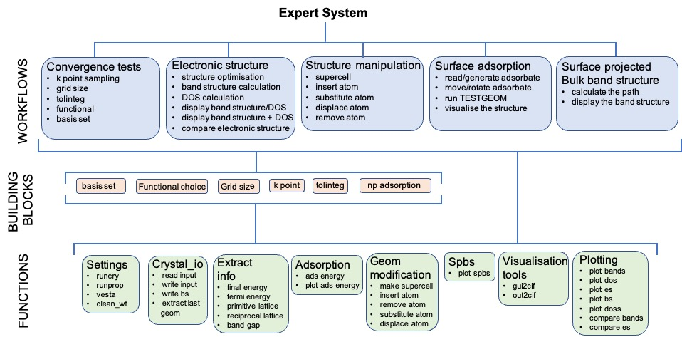

# crystal_python_tools
This repository contains python tools to be used with the electronic structure code CRYSTAL.

PROBLEM/NEED
This project was developed for both the experienced and non experienced python users and keeping in mind ease of use.

There are several fantastic python projects assisting computational chemists and material scientists in the interface and automatisation of simulations. For example, ASE, pymatgen,

The goal of this repository is simple, but hopefully appreciated by the CRYSTAL users that despite being fluent in unix, do not master python.

STRUCTURE

<b>Structure</b>
<ul>
  <li><b>Workflows</b> (jupyter notebook): these consist of a set of operation/calculations that are usually performed in a sequence. By setting few variables at the notebook, the user will be able to run a series of tasks, such as most of the convergence tests usually performed when starting to study a new material.
    <ul>
      <li>Convergence tests</li>
      <li>Electronic structure</li>
      <li>Surface adsorption</li>
      <li>Surface projected bulk band structure</li>
      <li>Structure manipulation</li>
    </ul>
  </li>
  <li><b>Building blocks</b> (jupyter notebook): these consist of a single task, such as testing the k point convergence.
   <ul>
       <li>basis set</li>
       <li>functional choice</li>
       <li>grid size convergence</li>
       <li>k point convergence</li>
       <li>sample adsorption sites</li>
       <li>sample surface</li>
       <li>tolinteg convergence</li>           
   </ul>
   <li> <b>Functions</b> (python files): these are the foundation upon which the whole repository is built. They perform the core tasks made available in a user friendly way in the jupyter notebooks.
    <ul>
      <li>settings</li>
      <li>crystal_io</li>
      <li>extract info</li>
      <li>adsorption</li>
      <li>geom modification</li>
      <li>spbs</li>
      <li>visualisation tools</li>
      <li>plotting</li>      
    </ul>
  </li>
</ul>

For a complete list of the different tasks that can be performed in the jupyter notebooks and functions, please refer to the picture below.

WHAT TO MODIFY IF YOU ARE EXPERIENCED OR NOT

USAGE
If you are not too familiar with python I recommend to only interact with the notebooks. These offer a variety of tasks and only require you to fill the variable section and run the cells you need. In case you modified the notebook and it stopped working (do not worry, it happens even to the best of us) you can find a clean version of all the notebooks in the <b>notebook_backup</b> folder.

I would recommend to use the repository as follows:
<ul>
  <li>
  if it is the very first time you are using the repository on a machine, run the <i>Settings</i> notebook. This will set variables such as where to find the runcry and runprop scripts;
  </li>
  <li>
  make a copy of the workflow or the building_blocks folder (or both folders if you plan to use both). Call the copied folders with a name that represents what you are researching, such as Ti02_water_splitting. It's important the folders are still in the crystal_python_tools folder (MODIFY THIS);
  </li>
  <li>
  fill the variable cell for each workflow/building_block you intend to use and enjoy the ease of running the notebook and having all your results analysed in a single place
  </li>
</ul>

STRUCTURE OF THE REPOSITORY

EXAMPLES
If this is your first time using the crystal_python_tools or if you need a refresher, please have a look at the <b>example</b> folder. In there you will find all the workflows and building_blocks run by using (mostly) MgO, a CRYSTAL all time favourite. These notebooks also include some extra explanations. Please do not copy these for production purposes since some of the parameters had to be modified to take into account the fact they are in the <b>example</b> folder.

HOW TO USE
  OPTIONS TO RUN, WRITE INPUT, ANALYSE
In terms of performing the calculations, the notebooks offer three options:
<ul>
  <li>
  <b>run = True</b>: the notebook will create the inputs, run the calculations and analyse the outputs. You can use this option if the CRYSTAL executable is install on the machine were you are running the notebooks;
  </li>
  <li>
  <b>run = False</b>: the notebook will create the inputs, but will not run the calculations. This is the option to use if the CRYSTAL executable is not installed on your machine or if the computing requirements exceed the ones of the machine were you are running the notebook;
  </li>
  <li>
  <b>run = Analyse</b>: the notebook will analyse the outputs present in the specified directory. This is the option to use if the calculations were performed on a different machine (for example a super computer) and you are analysing the results on your local machine.
  </li>
